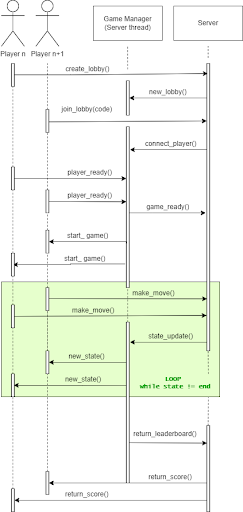
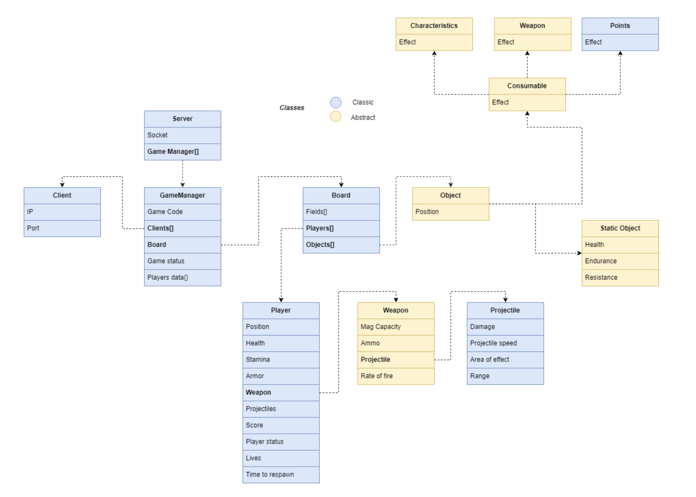

# Paintball Mania

**Autorzy**: Dawid Glazik 193069, Lucjan Gackowski 193150, Michał Tarnowski 193324, Stefan Furmański 193090

## Wprowadzenie

Sprawozdanie dotyczy projektu Paintball Mania na przedmiot Przetwarzanie Rozproszone. Zawiera proponowany model komunikacji, podstawowy schemat działania oraz komunikacji między graczami a serwerem, wraz z zaprezentowanym diagramem sekwencji.

## Model komunikacji

### Struktura wiadomości

Wybranym modelem komunikacji jest UDP, wykorzystywane w interfejsie socket udostępnionym w języku Python. Powodem tego wyboru jest prędkość, która przeważa na korzyść UDP nad TCP.

W przesyłanej zawartości od klienta do serwera będą: pozycja gracza i oddanie strzału. Serwer będzie przesyłał do klientów: dane o graczach i dane o planszy (np. Pozycje innych graczy, pozycje projectiles, informacje o punktach życia itp.)

## Diagram sekwencyjny

## Działanie aplikacji

Użytkownik łączy się z serwerem i decyduje czy rozpocząć nową rozgrywkę, czy dołączyć do istniejącej. Przy stworzeniu nowej rozgrywki, serwer tworzy nowy wątek obsługujący Game Managera, który kontroluje rozgrywkę, w przypadku połączenia do stworzonej już gry za pomocą kodu, serwer deleguje użytkownika do odpowiedniego Game Managera.

W momencie, w którym wszyscy gracze sygnalizują gotowość do gry, Serwer poprzez Game Managera rozpoczyna rozgrywkę.

W trakcie trwania rozgrywki, Serwer w pętli obsługuje zmiany w rozgrywce (zarówno te wywoływane przez graczy, jak i te następujące naturalnie), wysyłając graczom zmiany w stanie planszy, innych graczy itp.

W momencie, w którym rozgrywka zostaje oznaczona jako zakończona, Game Manager informuje serwer o zakończeniu gry i wysyła na serwer końcowy status gry (statystyki graczy, wyniki), który zostaje wysłany do każdego gracza, w celu przedstawienia wyników.

## Diagram klas

Powyższy diagram przedstawia klasy oraz połączenia między nimi. Klasy abstrakcyjne zostały przedstawione kolorem żółtym. Strzałki symbolizują zawieranie się klas. Klasą bazową jest więc Server, od której rozpoczyna się budowa drzewa zależności. Server powołuje Game Manager (klasę służącą do obsługi zdarzeń gry) i służy do komunikacji jej instancji z połączonymi z serwerem graczami (klasa Client). Game Manager przechowuje również klasę Board posiadającą informację na temat planszy i rozmieszczenia na niej zarówno graczy (klasa Player), jak i obiektów pobocznych (klasa Object). Obiekty te (np. Płoty, ściany, dodatkowe zdrowie, amunicja) dzielą się kolejno na te możliwe do zebrania (klasa Consumable) oraz statyczne, będące otoczeniem (klasa Static Object). Do tych pierwszych należą na przykład dodatkowe punkty zdrowia czy staminy (klasa Characteristics), dodatkowa/inna broń (klasa Weapons) oraz dodatkowe punkty (klasa Points).

Dla przejrzystości kodu i łatwości jego implementacji wprowadziliśmy również klasę Weapon reprezentującą broń aktualnie posiadana przez gracza. Ma ona w sobie klasę Projectile potrzebną do wprowadzenia do gry widocznych i oddziałujących z otoczeniem paintballowych kul.

## Potencjalne problemy

Problemy, które możemy spotkać przy implementacji projektu:

- Duże obciążenie po stronie serwera — będziemy musieli wziąć pod uwagę dużą ilość danych przetwarzanych przez serwer (nasłuchiwanie nowych graczy, obsługa logiczna rozgrywki oraz kontrolowanie stanów gry i graczy)
- Dynamiczna i płynna rozgrywka — serwer będzie musiał wysyłać tylko konkretne, zmieniające się w czasie, informacje o stanie gry do wszystkich graczy, aby zminimalizować opóźnienia w rozgrywce po stronie klienta (odpowiednia implementacja komunikacji sieciowej)
